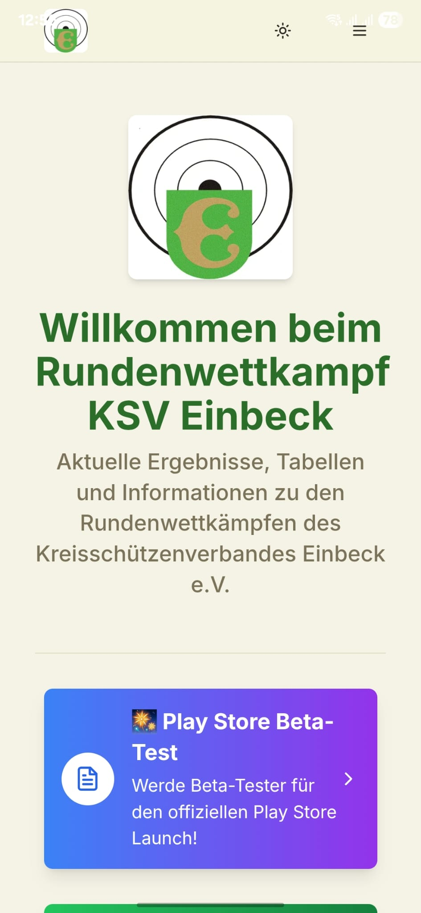
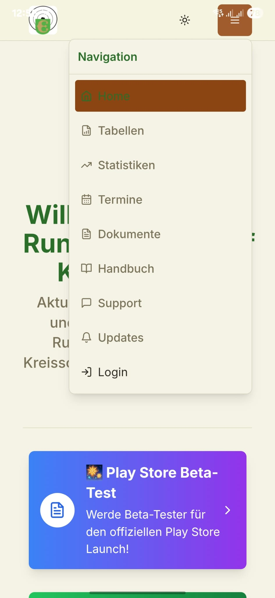

# 📸 RWK Einbeck App - Screenshots

> **Visuelle Übersicht der Hauptfunktionen**

## 🏠 Startseite & Navigation

### Moderne Benutzeroberfläche

Die Startseite bietet direkten Zugang zu allen wichtigen Funktionen mit einer modernen, benutzerfreundlichen Oberfläche.

### Mobile Navigation

Optimiert für mobile Geräte mit intuitivem Hamburger-Menü und Touch-freundlichen Elementen.

## 🏆 RWK-Tabellen (Hauptfunktion)

### Live-Tabellen

Automatische Berechnung der Rundenwettkampf-Tabellen mit Live-Updates und Auf-/Abstiegsplätzen.

### Detailansicht

Erweiterte Tabellenansicht mit Statistiken, Trends und detaillierten Mannschaftsinformationen.

## 🎯 Vereinsbereich & KM-System

### Vereins-Dashboard

Zentrales Dashboard für Vereinsvertreter mit Übersicht aller relevanten Funktionen und Statistiken.

### Kreismeisterschafts-Meldungen

Vollständige KM-Verwaltung von der Meldung bis zur Ergebniserfassung mit automatischer Validierung.

## 📊 Dashboard & Verwaltung

### Arbeitsbereich-Auswahl

Flexible Arbeitsbereich-Wahl je nach Benutzerrolle (Admin, Verein, Schütze) mit rollenspezifischen Funktionen.

### Dokumentenverwaltung

Zentrale Verwaltung aller wichtigen Dokumente mit PDF-Download und Kategorisierung.

## 🎨 Design-Prinzipien

- **Modern & Clean**: Minimalistisches Design mit Fokus auf Funktionalität
- **Mobile-First**: Optimiert für Smartphones und Tablets
- **Accessibility**: Barrierefreie Bedienung für alle Nutzer
- **Consistent**: Einheitliche UI-Elemente und Farbschema
- **Responsive**: Automatische Anpassung an verschiedene Bildschirmgrößen

## 📱 Unterstützte Geräte

- **Smartphones**: Android 7.0+ (empfohlen: Android 10+)
- **Tablets**: Optimierte Layouts für größere Bildschirme
- **Desktop**: Vollständige Web-Version über Browser
- **PWA**: Installation als Progressive Web App möglich

## 🔄 Live-Features in Screenshots

- ✅ **Real-time Updates**: Sofortige Synchronisation zwischen Geräten
- ✅ **Offline-Fähigkeit**: Grundfunktionen auch ohne Internet
- ✅ **Push-Notifications**: Benachrichtigungen über wichtige Updates
- ✅ **Dark/Light Mode**: Automatische Theme-Anpassung
- ✅ **Touch-Optimierung**: Gestensteuerung und Touch-freundliche Buttons

---

*Alle Screenshots zeigen die aktuelle Version 0.11.7 der Web-App und Version 0.9.4.1 der Android-App.*