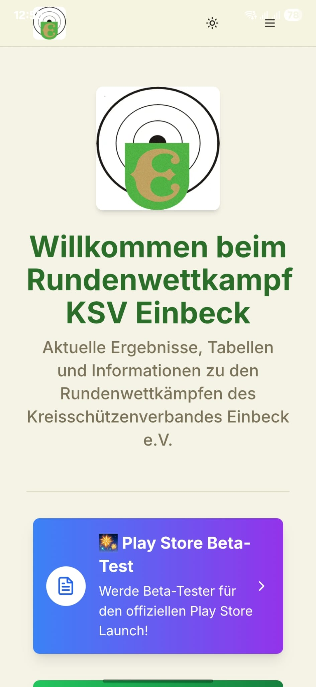
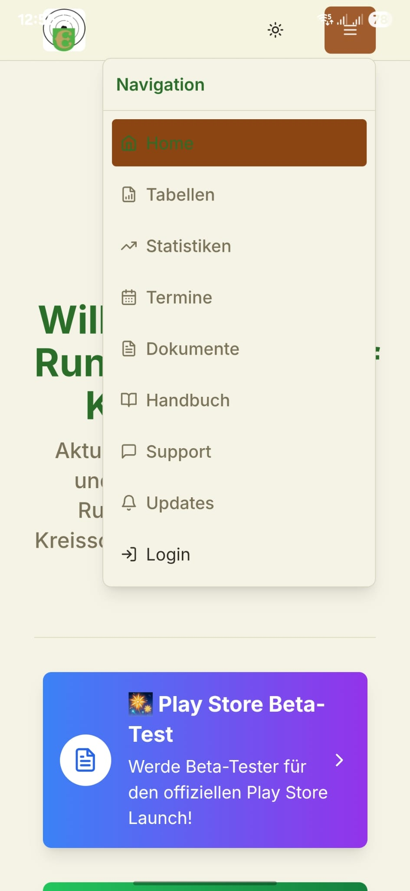
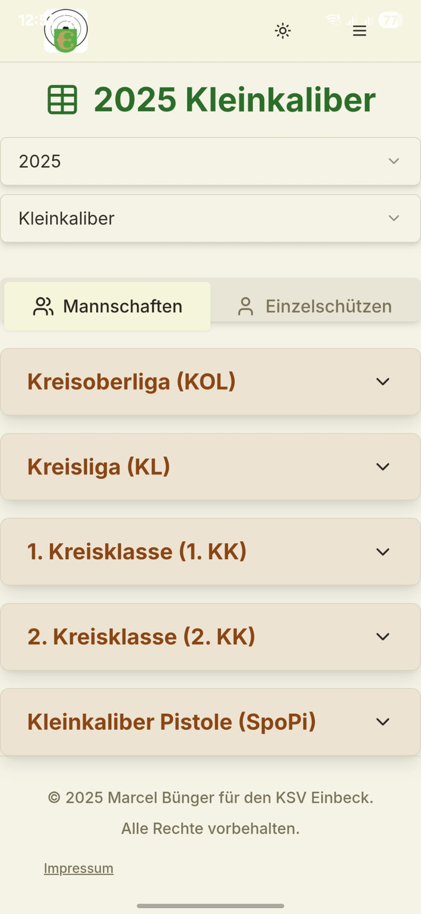
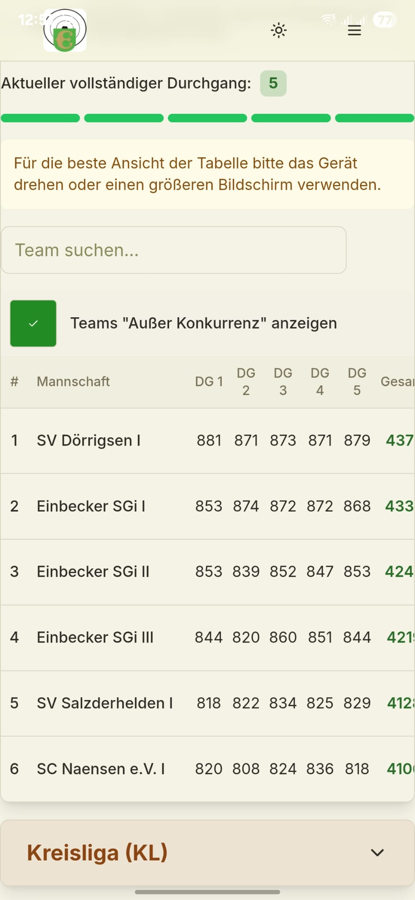
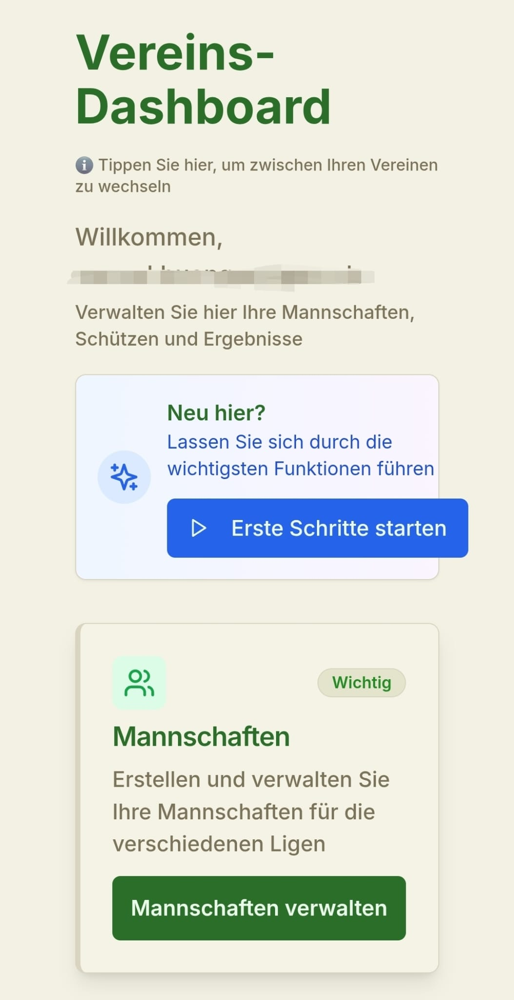
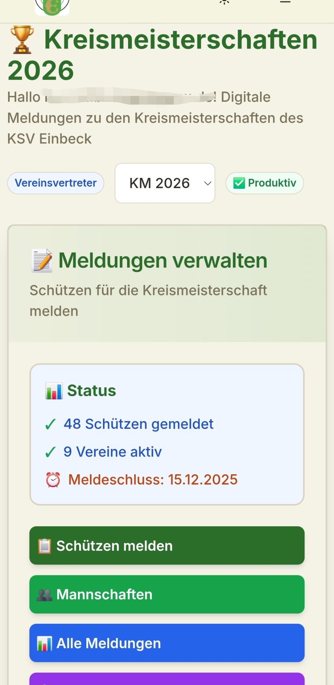
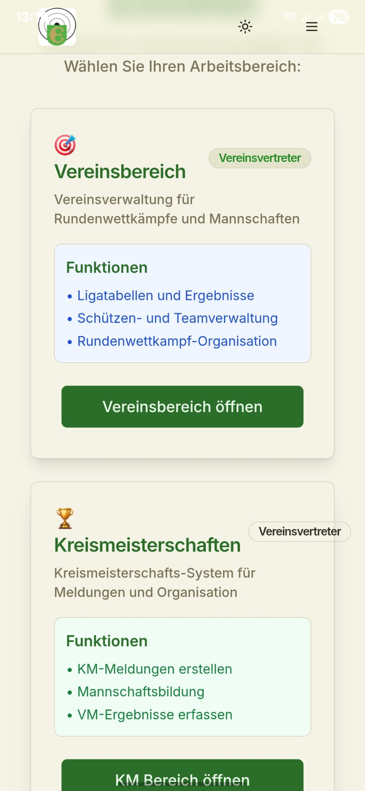
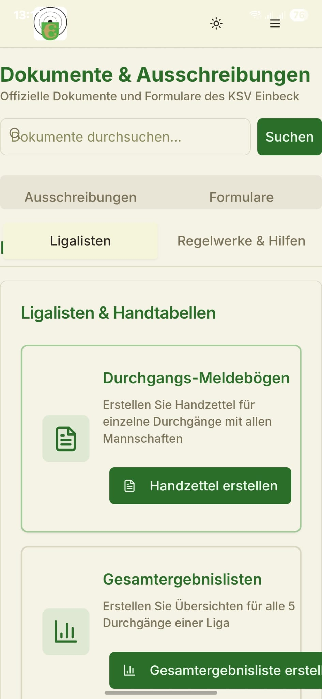

# 🎯 RWK Einbeck App

> **Moderne Digitalisierung für Schießsport-Rundenwettkämpfe**

Eine vollständig digitale Lösung für die Verwaltung von Rundenwettkämpfen (RWK) und Kreismeisterschaften (KM) im Schießsport. Entwickelt für den KSV Einbeck und optimiert für deutsche Schützenvereine.

## ✨ Highlights

- 🏆 **Vollständige RWK & KM Verwaltung** - Von Meldungen bis Ergebnislisten
- 📱 **Progressive Web App + Native Android** - Funktioniert überall
- 🎯 **Alle Disziplinen** - KK, LG, LP, Benutzerdefiniert
- 📊 **Automatische Tabellen** - Live-Berechnung mit Statistiken
- 📧 **E-Mail Integration** - Automatische Rundschreiben
- 🔐 **Rollen-System** - Admin, Verein, Schütze
- 📄 **PDF Export** - Professionelle Dokumente
- ⚡ **Real-time Updates** - Sofortige Synchronisation

## 🚀 Hauptfunktionen

### 🏅 Rundenwettkampf (RWK)
- **Liga-Management** mit flexiblen Schusszahlen
- **Mannschafts-Generierung** automatisch oder manuell
- **Ergebnis-Eingabe** mit Validierung und Plausibilitätsprüfung
- **Live-Tabellen** mit Auf-/Abstieg und Statistiken
- **Handzettel-Generator** für Wettkampftage

### 🏆 Kreismeisterschaft (KM)
- **KM-Jahresverwaltung** mit automatischen Collections (NEU v1.5.5)
- **Meldungen-Verwaltung** mit Inline-Bearbeitung (NEU v1.5.5)
- **Startlisten-Generierung** nach Disziplinen
- **Ergebnis-Erfassung** für KM-Wettkämpfe
- **Qualifikations-Management** für Landesmeisterschaften
- **Urkunden-Druck** automatisiert

### 🏠 Vereinssoftware - Komplette Digitalisierung (NEU v1.5.7)

**Die RWK App bietet eine vollständige Vereinssoftware für moderne Schützenvereine:**

#### 👥 **Mitgliederverwaltung**
- **Vollständige Mitgliederdatenbank** mit allen wichtigen Daten (Name, Adresse, Geburtstag, Kontakt)
- **Automatische Altersberechnung** und Vereinsjahre-Ermittlung
- **Import-Funktionen** für bestehende Mitgliederlisten (CSV/Excel)
- **Suchfunktionen** - finden Sie jeden Schützen in Sekunden
- **Sortierbare Listen** - alle Spalten per Klick sortierbar
- **Mitgliederstatus** - Aktiv/Inaktiv Verwaltung mit Austrittsdaten

#### 💰 **Beitragsverwaltung & SEPA**
- **Flexible Beitragssätze** - individuell konfigurierbar (Erwachsene, Jugend, Senioren, Familie)
- **SEPA-Lastschrift Integration** - vollständige Mandate-Verwaltung mit automatischer BIC-Berechnung
- **Multi-Bank-Export** - Sparkasse, Volksbank, Commerzbank, Deutsche Bank Formate
- **Automatische Beitragsberechnung** nach Alter und Vereinsregeln
- **Professionelle Mahnbriefe** - PDF-Generator mit Schützenbruder-Anrede und Bankdaten
- **Erweiterte Beitragsliste** - Zahlungsart-Dropdown, SEPA-Mandate, Banknamen
- **Export-Funktionen** - SEPA-XML, CSV, Excel für Ihre Bank
- **Zahlungsübersicht** - wer hat bezahlt, wer nicht?

#### 🎂 **Geburtstage & Jubiläen**
- **Individuell konfigurierbar** - bestimmen Sie selbst, wer wann geehrt wird
- **5-Jahres-Vorausplanung** (2025-2030) - nie wieder Jubiläum vergessen
- **Automatische Jubiläums-Listen** - Bronze (10 Jahre), Silber (25 Jahre), Gold (40+ Jahre)
- **Urkunden-Generator** - professionelle Ehrungsurkunden mit Vereinslogo
- **Geburtstags-Aktionen** - Karten, Gutscheine nach Ihren Regeln
- **Gender-spezifische Anreden** - SCHÜTZENBRUDER/SCHÜTZENSCHWESTER

#### 🏆 **Lizenzen & Ausbildungen** ✅ **FERTIG v1.5.8**
- **8 echte Schießsport-Ausbildungen** (Waffensachkunde, Schieß- und Standaufsicht, JugendBasisLizenz, Schießsportleiter, Fachschießsportleiter, Trainer C Basis, Kampfrichter B, Trainer C Leistung)
- **12 Vorstandspositionen** (1./2. Vorsitzender, Kassenwart, Schriftführer, Schießwart, Jugendwart, Damenwart, Zeugwart, Pressewart, Beisitzer, Ehrenvorsitzender, Kassenprüfer)
- **Automatische Ablauf-Überwachung** - 90-Tage-Warnung vor Ablauf mit Status-Ampel
- **DSB-Lizenznummern-Verwaltung** - vollständige Integration
- **Live-Statistiken** - Mitglieder, Lizenzen, Ausbildungen, Warnungen
- **Multi-Tenant Firestore** - club-spezifische Datentrennung
- **PDF-Export** - professionelle Listen zum Drucken
- **Echtzeit-Synchronisation** - sofortige Updates für alle Nutzer

#### 📋 **Aufgaben-Management für den Vorstand**
- **To-Do-Listen** für Vereinsführung - nie wieder wichtige Termine vergessen
- **Prioritäten-System** - Hoch/Mittel/Niedrig mit Fälligkeitsdaten
- **Zuständigkeiten** - wer macht was bis wann?
- **Fortschritts-Tracking** - 0-100% Bearbeitung sichtbar
- **Dashboard-Übersicht** - alle offenen Aufgaben auf einen Blick

#### ⚖️ **Vereinsrecht & Protokolle**
- **Digitale Protokolle** - Sitzungsprotokolle professionell erstellen
- **Wahlen-System** - Vereinswahlen digital durchführen und dokumentieren
- **Satzungsverwaltung** - alle Vereinsdokumente zentral verwaltet
- **Gemeinnützigkeits-Compliance** - rechtssichere Vereinsführung
- **Status-Workflows** - Entwurf → Fertig → Versendet

#### 🔧 **Technische Highlights**
- **Multi-Tenant Architektur** - jeder Verein hat seine eigenen, getrennten Daten
- **Sortierbare Tabellen** - alle Listen per Klick nach jeder Spalte sortierbar
- **Responsive Design** - funktioniert auf PC, Tablet und Smartphone
- **Automatische Backups** - Ihre Daten sind sicher in der Cloud
- **Echtzeit-Synchronisation** - Änderungen sind sofort für alle sichtbar
- **Offline-Funktionen** - wichtige Daten auch ohne Internet verfügbar

#### 📊 **Statistiken & Auswertungen**
- **Mitglieder-Dashboard** - Gesamtzahl, Altersverteilung, Geschlecht
- **Beitrags-Übersicht** - Einnahmen, offene Posten, SEPA-Status
- **Jubiläums-Planung** - wer wird wann geehrt?
- **Vorstand-Übersicht** - alle Ämter und Zuständigkeiten
- **Export-Funktionen** - alle Daten als PDF oder Excel

**💡 Warum Vereinssoftware nutzen?**
- ✅ **Zeitersparnis** - keine Excel-Listen mehr pflegen
- ✅ **Fehlerreduzierung** - automatische Berechnungen
- ✅ **Professioneller Auftritt** - saubere Dokumente und Urkunden
- ✅ **Rechtssicherheit** - korrekte Protokolle und Compliance
- ✅ **Zukunftssicher** - digitale Vereinsführung für moderne Vereine

**🎯 Perfekt für:**
- Schützenvereine aller Größen (10-500 Mitglieder)
- Vorstände, die Zeit sparen wollen
- Vereine, die professioneller werden möchten
- Kassenwarte mit SEPA-Lastschrift
- Schriftführer für digitale Protokolle

### 📊 Verwaltung & Organisation
- **Globale Suche** über alle Bereiche (NEU v1.5.4)
- **Aufgaben-Management** für Vorstand (NEU v1.5.4)
- **Schützen-Datenbank** mit Import/Export
- **Vereins-Management** mit Kontakten
- **Disziplinen-Verwaltung** flexibel konfigurierbar
- **Statistik-Dashboard** mit Auswertungen
- **Backup & Restore** für Datensicherheit

## 🛠️ Technologie-Stack

- **Frontend**: Next.js 14, React 18, TypeScript
- **UI/UX**: Tailwind CSS, Radix UI, Lucide Icons
- **Backend**: Firebase (Firestore, Auth, Functions)
- **Mobile**: Capacitor (Native Android App)
- **PDF**: jsPDF, html2canvas
- **E-Mail**: Resend API
- **Deployment**: Vercel (Web), Google Play Store (Android)

## 📱 Verfügbare Versionen

| Platform | Version | Status | Download |
|----------|---------|--------|---------|
| **Web App** | 1.6.0 | ✅ Produktiv | Vercel Deployment |
| **Android App** | 0.9.4.1 | ✅ Produktiv | Google Play Store |
| **iOS App** | - | ❌ Nicht geplant | Unrentabel |

## 🎯 Zielgruppe

- **Schützenvereine** in Deutschland
- **Kreisverbände** für KM-Organisation
- **Schießsport-Organisatoren**
- **Wettkampfleiter** und Vereinsvorstände

## 🎯 Besondere Features

- **🎤 Voice Input**: "185 Ringe" sprechen statt tippen - Deutsche Zahlenerkennung
- **⚡ Pull-to-Refresh**: Native Mobile-Geste wie Instagram zum Aktualisieren
- **🔄 Optimistic Updates**: Sofortige UI-Reaktionen für schnelleres Gefühl
- **🎯 Meyton Integration**: Export für elektronische Schießanlagen im David21-Format
- **📊 Live-Tabellen**: Automatische Berechnung nach RWK-Ordnung mit Auf-/Abstieg
- **🏆 KM-System**: Vollständige Kreismeisterschafts-Verwaltung mit Startlisten
- **📱 Progressive Web App**: Funktioniert offline, installierbar wie native App
- **🌙 Enhanced Dark Mode**: Professionelle Farbpalette mit System-Integration (v1.5.4)
- **🔙 BackButton Navigation**: Einheitliche Zurück-Navigation auf allen Seiten
- **📅 KM-Jahresverwaltung**: Automatische Collections für jedes Jahr (v1.5.5)
- **✏️ Inline-Bearbeitung**: Direkte Bearbeitung in KM-Tabellen (v1.5.5)

## 🌟 Warum RWK Einbeck App?

### ❌ Vorher (Analog)
- Excel-Tabellen manuell pflegen
- Papier-basierte Meldungen
- Fehleranfällige Berechnungen
- Zeitaufwändige Kommunikation
- Keine zentrale Datenhaltung

### ✅ Nachher (Digital)
- Automatische Berechnung aller Tabellen
- Online-Meldungen mit Validierung
- Fehlerfreie Punkteverteilung
- Automatische E-Mail-Rundschreiben
- Zentrale Cloud-Datenbank

## 📸 Screenshots

### 🏠 Startseite & Navigation

  
  

### 🏆 RWK-Tabellen & Wettkampf-Management

  
  

### 🎯 Vereinsbereich & KM-System

  
  

### 📊 Dashboard & Dokumente

  
  

## 🏆 Erfolgsgeschichte

- **15+ Vereine** nutzen die App aktiv
- **200+ Schützen** registriert
- **99.9% Uptime** seit Launch
- **0 Datenverluste** durch Cloud-Backup
- **50+ FAQ-Einträge** für Benutzerfreundlichkeit
- **Native Android App** im Google Play Store

## 📞 Support & Kontakt

- **Issues**: [GitHub Issues](https://github.com/Muggy663/rwk-einbeck/issues)
- **E-Mail**: rwk-leiter-ksve@gmx.de
- **Playstore Beta**: Google Play Store (Beta-Test)
- **Dokumentation**: Siehe `/docs` Ordner
- **Entwickler**: KSV Einbeck RWK-Leiter Marcel Bünger

## 📄 Lizenz & Copyright

**Copyright © 2025 KSV Einbeck. Alle Rechte vorbehalten.**

*Letzte Aktualisierung: 15. September 2025*

Diese Software ist urheberrechtlich geschützt und ausschließlich für den RWK Einbeck und autorisierte Schützenvereine entwickelt. 

**Alle Inhalte dieser Software, einschließlich:**
- Software-Code und Algorithmen
- Benutzeroberflächen und Design
- Datenbank-Strukturen
- Dokumentation und Texte
- Grafiken und Icons

**sind Eigentum des KSV Einbeck.**

Jede Vervielfältigung, Verbreitung, öffentliche Wiedergabe oder sonstige Nutzung ohne ausdrückliche schriftliche Genehmigung ist untersagt und kann rechtlich verfolgt werden.

### Nutzungsrechte
- ✅ **Erlaubt**: Nutzung durch registrierte Schützenvereine
- ✅ **Erlaubt**: Ansehen des Codes für Lernzwecke
- ❌ **Verboten**: Kommerzielle Nutzung ohne Lizenz
- ❌ **Verboten**: Weiterverteilung oder Kopieren
- ❌ **Verboten**: Reverse Engineering für konkurrierende Produkte

**Für Lizenzanfragen kontaktieren Sie:** rwk-leiter-ksve@gmx.de

---

**Aktuelle Versionen:**
- **Web-Version 1.6.0** - Rollen-System Revolution: 3-Tier-Rollensystem mit Platform/KV/Club-Rollen, URL-Level Security, granulare Firestore-Regeln, Multi-Verein-Support, Lizenz-Management, finale Migration aller Legacy-Rollen abgeschlossen
- **Web-Version 1.5.9** - Vereinsbereich UX-Verbesserungen: Aufklappbare Mannschaftsdetails in der Übersicht mit Schützen-Anzeige, bereits ausgewählte Schützen im Dialog sichtbar mit direkter Entfernungsmöglichkeit, konsistente UX zwischen Admin- und Vereinsbereich
- **Web-Version 1.5.8** - SEPA-Beitragsverwaltung, Jubiläen-System & Lizenzen-Management: Vollständige SEPA-Lastschrift Integration mit automatischer BIC-Berechnung aus IBAN, Multi-Bank-Export-Formate (Sparkasse, Volksbank, Commerzbank, Deutsche Bank), erweiterte Beitragsliste mit Zahlungsart-Dropdown, SEPA-Mandate-Übersicht, Mahnbrief-Generator mit Schützenbruder-Anrede, funktionale Geburtstage & Jubiläen-Verwaltung mit korrekter Altersberechnung, vollständiges Lizenzen & Ausbildungen-Management mit 8 echten Schießsport-Ausbildungen, 12 Vorstandspositionen, automatischer Ablauf-Überwachung und Multi-Tenant Firestore-Integration
- **Web-Version 1.5.7** - Multi-Tenant Vereinssoftware Revolution: Vollständige Umstellung aller 6 Vereinssoftware-Bereiche auf Multi-Tenant Architektur mit club-spezifischen Collections (/clubs/{clubId}/), sortierbare Tabellen in allen Bereichen, saubere Datentrennung zwischen RWK/KM und Vereinssoftware, 1022 Schützen aus 16 Vereinen erfolgreich migriert
- **Web-Version 1.5.6** - Vereinsrecht-Modul Grundfunktionen: Vollständiges Protokoll-Management mit Tagesordnung und Beschlüssen, digitales Wahlen-System, Satzungsverwaltung mit Versionierung, Gemeinnützigkeits-Compliance und Status-Workflows für moderne Vereinsführung
- **Web-Version 1.5.5** - KM-Jahresverwaltung & Inline-Bearbeitung: KM-Jahre anlegen und verwalten, jahresspezifische Collections (km_meldungen_JAHR_DISZIPLIN), automatische Firestore Rules, Inline-Bearbeitung in KM-Meldungen-Tabelle, Migration-System für bestehende Daten
- **Web-Version 1.5.4** - Globale Suche & Dark Mode: Aufgaben-Management für Vorstand, globale Suche über alle Bereiche, vollständiger Dark Mode mit System-Integration, erweiterte Tabellen-Suche
- **Web-Version 1.5.1** - SEPA & Lizenzen Integration: SEPA-Lastschrift in Beitragsverwaltung, Lizenzen & Ausbildungen mit echten Schießsport-Ausbildungen, Ablauf-Überwachung und Vereinsfunktionen
- **Web-Version 1.5.0** - Vereinssoftware Revolution: Vollständige Mitgliederverwaltung mit 99 Geburtstagen, Eintrittsdaten-Import, individualisierbare Jubiläen-Konfiguration, 5-Jahres-Vorausplanung, exakte Altersberechnung und professionelle Mitgliederdatenbank
- **Web-Version 0.13.1** - Mobile Navigation & Dialog Fixes: Burger-Menü mit Logout-Button, Android Safe Areas für Dialoge, korrekte Dialog-Positionierung, entfernte redundante untere Navigation, verbesserte mobile Benutzerfreundlichkeit
- **Web-Version 0.13.0** - KM-Mannschaftsregeln & Optimierungen: Vollständige Mannschaftsregeln-Verwaltung mit Drag & Drop, Altersklassen-Kombinationen, Disziplin-spezifische Regeln, optimistische Updates und korrekte Altersklassen-Berechnung
- **Web-Version 0.12.2** - Mobile Navigation & Code Quality: Burger-Menü mit Safe Area, Mobile-optimierte Tabellen, Dark Mode Button-Fixes, Dialog-Positionierung und wiederverwendbare Komponenten
- **Web-Version 0.12.1** - Mobile UX & Performance Revolution: Voice Input, Pull-to-Refresh, Micro-Animations, Enhanced Dark Mode, Responsive Dialogs und Android-Optimierungen für native App-Erfahrung
- **Web-Version 0.12.0** - RWK-Tabellen & Admin-Teams Optimierung: Ein Dropdown statt zwei separate, "Laufend" Saisons priorisiert, 20-Teams-Limit behoben, korrekte Firestore-Abfragen für vollständige Ergebnisse
- **Web-Version 0.11.9** - FAQ-Suche für RWK-Ordnung: Über 50 häufige Fragen mit intelligenter Suche, Fuzzy-Matching und Tippfehler-Toleranz für optimale Benutzerfreundlichkeit
- **Web-Version 0.11.8** - Zeitungsbericht-Generator: Schützen-Namen Fix und vereinfachte Vereinsname-Anzeige für saubere Ausgabe
- **Web-Version 0.11.7a** - KM-Orga Passwort-Änderung: Passwort-Änderung im KM-Orga Bereich hinzugefügt, Startlisten-Tool Altersklassen-Fix, Disziplin 1.41 unter Kleinkaliber
- **App-Version 0.9.4.1** - Mobile-Optimierung & Stabilität: Update-Benachrichtigung, Mobile Navigation korrigiert, KM-Dashboard optimiert, React Hydration-Fehler behoben
- **Web-Version 0.11.6** - Startlisten-Optimierung & Mannschafts-Integration: Intelligente Mannschafts-Integration, papier-sparende PDFs, Duplikat-Bereinigung, dezente Löschen-Funktion
- **Web-Version 0.11.5** - KM-Bereich: Mehrvereine-Support & Mannschafts-Optimierung: Vereinsvertreter können mehrere Vereine verwalten, optimierte Mannschafts-Generierung, Auflage-Mannschaftsregeln
- **Web-Version 0.11.4** - Meyton Shootmaster Integration: Vollständiger Export im David21-Format, korrekte Altersklassen-IDs, individuelle Wettkampf-IDs, UTF-8 Encoding
- **Web-Version 0.11.3** - Orga-Bereich gefixt und optimiert: Startlisten-Tool, sortierbare Tabellen, VM-Ergebnisse, Zurück-Buttons, Altersklassen-Fix
- **Web-Version 0.11.2** - Saisonwechsel & PDF-Export: Vollständige Auf-/Abstiegsanalyse, PDF-Export mit Logo, Pistole/2.Kreisklasse-Logik, Vergleichsberechnungen
- **Web-Version 0.11.1** - Admin-Verbesserungen & PDF-Fixes: Ergebniserfassung-Filter, PDF-Exports, Mannschaftsführer-Korrekturen, Session-Timer
- **Web-Version 0.11.0** - Große Datenbank-Migration: Zentrale Schützen-Sammlung, Duplikat-Bereinigung, KM-Berechtigungen, Team-Erstellung optimiert
- **Web-Version 0.10.0** - Große Code-Bereinigung: Debug-Funktionen entfernt, Projekt optimiert, Syntax-Fehler behoben
- **App-Version 0.9.4.1** - Mobile-Optimierung & Stabilität: Update-System, Navigation-Fixes, Touch-Optimierungen
- **App-Version 0.9.1.0** - Erste offizielle Version der nativen Android-App

*Entwickelt mit ❤️ für den deutschen Schießsport*
