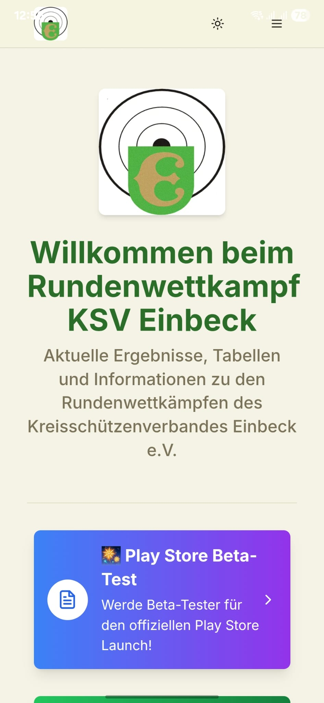
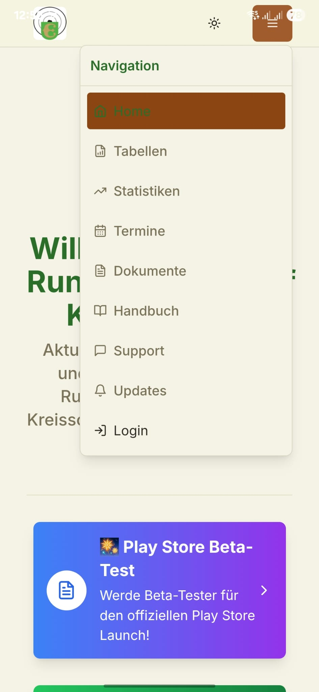
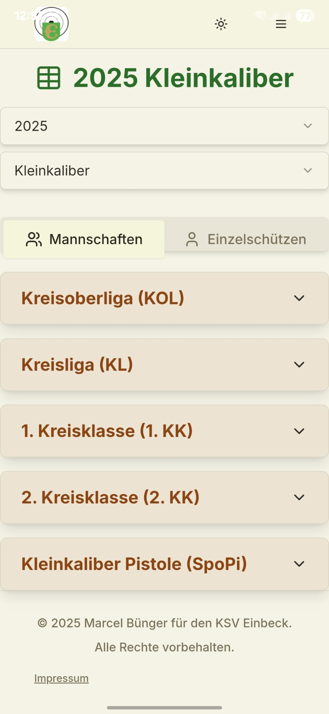
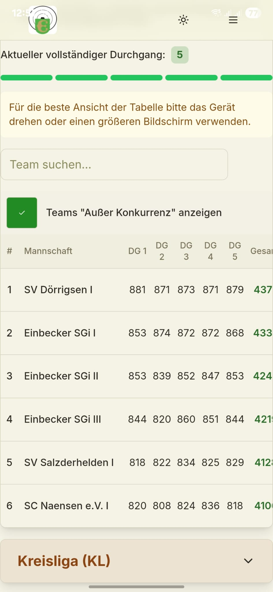
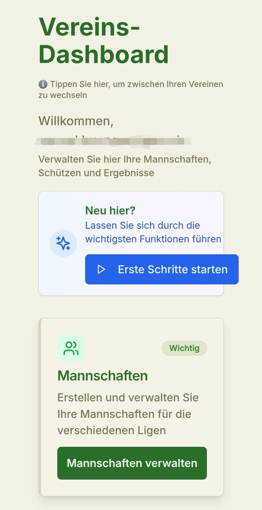
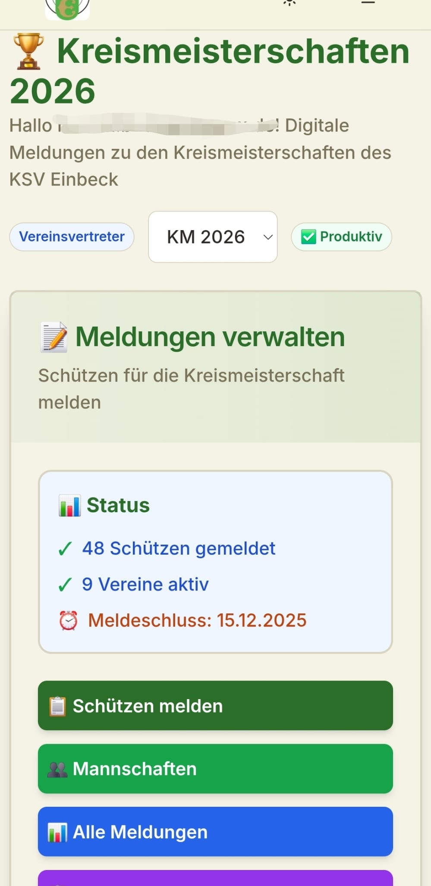
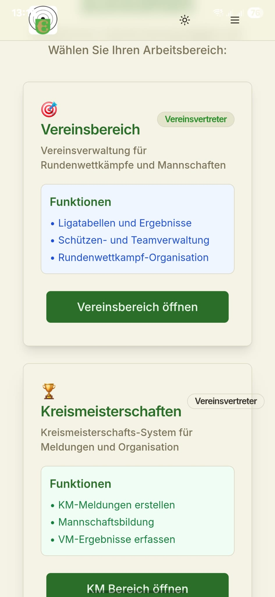
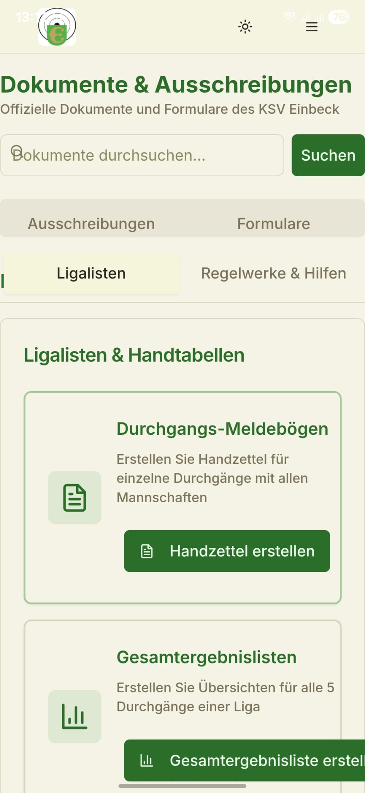

# 🎯 RWK Einbeck App

**Version: 3.0.1** | **Android: 1.0.0** | **04.09.2026**

> **Digitale Plattform für den deutschen Schießsport**

Eine vollständig digitale Lösung für Rundenwettkämpfe (RWK), Kreismeisterschaften (KM) und den digitalen Schießnachweis. Automatische Tabellen, KI-gestützte Ergebniserfassung und moderne Vereinsverwaltung.

## ✨ Highlights

### 🏆 Klassische Features
- **Vollständige RWK & KM Verwaltung** - Von Meldungen bis Ergebnislisten
- **Zentrale Mitgliederliste (RWK + KM)** - Ein Datenbestand, eine abgesicherte Verwaltung für beide Bereiche
- **Progressive Web App + Native Android** - Funktioniert überall
- **Alle Disziplinen** - KK, LG, LP, Benutzerdefiniert
- **Automatische Tabellen** - Live-Berechnung mit Statistiken
- **Google Gemini AI OCR** - Intelligente Handzettel-Erkennung
- **Schießnachweis** - Digitales Schießtagebuch

## 🚀 Hauptfunktionen

### 🏅 Rundenwettkampf (RWK)
- **Liga-Management** mit flexiblen Schusszahlen
- **Mannschafts-Generierung** automatisch oder manuell
- **Ergebnis-Eingabe** mit Validierung und Plausibilitätsprüfung
- **OCR Handzettel-Erkennung** - Foto hochladen, automatisch auslesen
- **Live-Tabellen** mit Auf-/Abstieg und Statistiken
- **Handzettel-Generator** für Wettkampftage

### 🏆 Kreismeisterschaft (KM)
- **KM-Jahresverwaltung** mit automatischen Collections
- **Meldungen-Verwaltung** mit Inline-Bearbeitung
- **Startlisten-Generierung** nach Disziplinen
- **Ergebnis-Erfassung** für KM-Wettkämpfe
- **Qualifikations-Management** für Landesmeisterschaften
- **Urkunden-Druck** automatisiert

### 🎯 Schießnachweis
- **Digitales Schießtagebuch** für Sportschützen
- **4-Schritt Wizard-UI** — mobile-optimierte Eingabe (Disziplin → Methode → Ergebnis → Details)
- **Training & Wettkampf** Dokumentation
- **4 Eingabemethoden** — Schnelleingabe, Serien, Scheibe fotografieren (Beta), Ausdruck scannen (Beta)
- **Scheiben-Scanner (Beta)** — KI erkennt Einschusslöcher auf Papierscheiben automatisch
- **Import von digitalen Anlagen** — Meyton, Sius, Disag, Sport Quantum
- **Mitcom Excel-Import** — Vereinsmitglieder mit automatischem Matching importieren
- **Cloud-Synchronisation** — Multi-Device-Zugriff
- **Erweiterte Statistiken** — Detaillierte Leistungsanalysen mit Filtern
- **PDF-Export für Behörden** — Offizieller Nachweis für Waffenbehörde

### 📊 Verwaltung & Organisation
- **Zentrale Mitgliederliste** - Gemeinsame Liste für RWK und KM (`/mitglieder`); KM-Ansicht mit Mitgliedsnummer und Altersklassen. Abgesicherte API, rollenbasierter Zugriff und sanftes Löschen (Ergebnisse bleiben erhalten)
- **Disziplinen-Verwaltung** flexibel konfigurierbar
- **Statistik-Dashboard** mit Auswertungen
- **KI-Startlisten Generator V2** - Intelligente Optimierung mit Vereins-Limits
- **Altersklassen-Automatik** - DSB-konforme Berechnung nach Geburtsjahr
- **Live-Tabellen** - Automatische Berechnung nach RWK-Ordnung
- **KM-System** - Vollständige Kreismeisterschafts-Verwaltung
- **Meyton Integration** - Export für elektronische Schießanlagen
- **Google Gemini AI** - Intelligenteste OCR-Erkennung für Handzettel
- **Scheiben-Scanner (Beta)** - KI-basierte Erkennung von Einschusslöchern

## 📱 Verfügbare Versionen

| Platform | Status | Download |
|----------|--------|---------|
| **Web App** | ✅ Produktiv | Vercel Deployment |
| **Android App** | ✅ Produktiv | Google Play Store |
| **Safari (iPhone)** | ✅ Mobile | Vollständig mobil nutzbar |
| **iOS App** | ❌ Nicht geplant | Unrentabel |

## 🌟 Warum RWK Einbeck App?

### ❌ Vorher (Analog)
- Excel-Tabellen manuell pflegen
- Papier-basierte Meldungen
- Keine automatische Auswertung
- Zeitaufwändige Kommunikation
- Manuelle Altersklassen-Berechnung
- Fehleranfällige Startlisten-Erstellung

### ✅ Nachher (Digital)
- **Automatische Berechnung** aller Tabellen und Ranglisten
- **KI-gestützte Ergebnis-Eingabe** via Foto (Handzettel-OCR + Scheiben-Scanner)
- **Mitcom-Import** für Vereinsmitglieder mit automatischer Geschlechts- und Altersklassen-Zuordnung
- **Dynamisches KM-System** — Sportjahr, Altersklassen und Disziplinen berechnen sich automatisch
- **KI-Startlisten Generator** mit automatischer Optimierung und Altersklassen-Berechnung
- **Schießnachweis** mit Wizard-UI für schnelle Eingabe auf dem Smartphone

## 📋 Changelog

Den vollständigen Changelog findest du in der [CHANGELOG.md](./CHANGELOG.md).

**Aktuell: Version 3.0.1 (04.09.2026)** – Zentrale Mitgliederliste für RWK und KM mit abgesicherter API, rollenbasiertem Zugriff und sanftem Löschen. Serverseitig abgesicherte KM-Schnittstellen, einheitliche Altersklassen-Ermittlung, Meldefenster-Hinweis auf der Startseite und diverse Fehlerbehebungen. Abgeschlossene TypeScript-Grundsanierung (~3860 → 0 Meldungen) als Fundament.

## 📸 Screenshots

### 🏠 Startseite & Navigation

  
  

### 🏆 RWK-Tabellen & Wettkampf-Management

  
  

### 🎯 Vereinsbereich & KM-System

  
  

### 📊 Dashboard & Dokumente

  
  

## 📞 Support & Kontakt

- **Issues**: [GitHub Issues](https://github.com/Muggy663/rwk-einbeck/issues)
- **E-Mail**: rwk-leiter-ksve@gmx.de
- **Playstore Beta**: Google Play Store (Beta-Test)
- **Dokumentation**: Siehe `/docs` Ordner
- **Entwickler**: KSV Einbeck RWK-Leiter Marcel Bünger

## 📄 Lizenz & Copyright

**Copyright © 2025-2026 KSV Einbeck. Alle Rechte vorbehalten.**

*Letzte Aktualisierung: 04.09.2026 - Version 3.0.1*

Diese Software ist urheberrechtlich geschützt und ausschließlich für den RWK Einbeck und autorisierte Schützenvereine entwickelt. 

**Alle Inhalte dieser Software, einschließlich:**
- Software-Code und Algorithmen
- Benutzeroberflächen und Design
- Datenbank-Strukturen
- Dokumentation und Texte
- Grafiken und Icons

**sind Eigentum des KSV Einbeck.**

Jede Vervielfältigung, Verbreitung, öffentliche Wiedergabe oder sonstige Nutzung ohne ausdrückliche schriftliche Genehmigung ist untersagt und kann rechtlich verfolgt werden.

### Nutzungsrechte
- ✅ **Erlaubt**: Nutzung durch registrierte Schützenvereine
- ✅ **Erlaubt**: Ansehen des Codes für Lernzwecke
- ❌ **Verboten**: Kommerzielle Nutzung ohne Lizenz
- ❌ **Verboten**: Weiterverteilung oder Kopieren
- ❌ **Verboten**: Reverse Engineering für konkurrierende Produkte

**Für Lizenzanfragen kontaktieren Sie:** rwk-leiter-ksve@gmx.de

---

*Entwickelt mit ❤️ für den deutschen Schießsport*